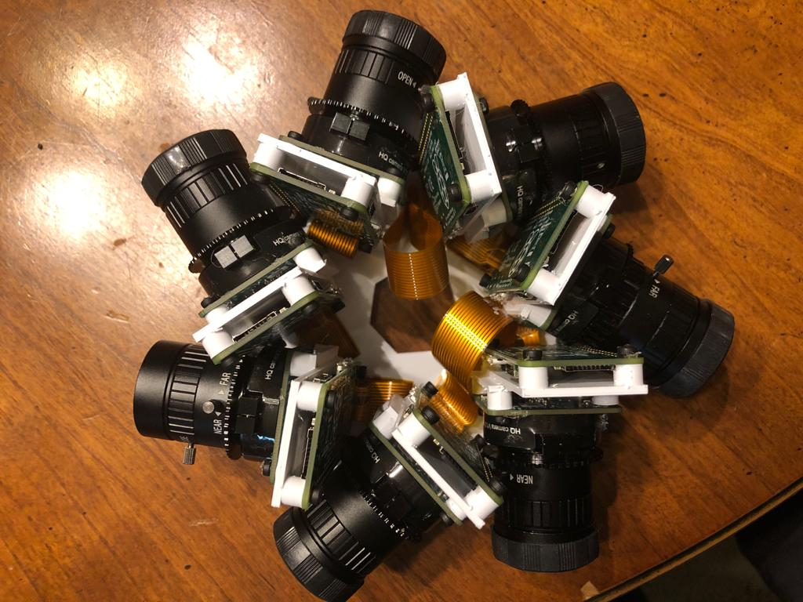

# odm360

## Overview

This repository contains code for the EECS 398 group working on the odm360 project with the Cleveland Metroparks, and all the great extensions and reinventions of that code for all the other things we want to do. The idea is to build a 360 camera from individual cameras for the purposes of high quality 3D reconstructions in challenging environments where drones don't work or don't work well.

The original plan used a Sony α6000 using [gphoto2](http://gphoto.org/), but the project has been expanded to use [that fancy new Raspberry Pi camera](https://www.raspberrypi.org/products/raspberry-pi-high-quality-camera/).



See also: https://www.opendronemap.org/2020/05/360-cameras/

## Quickstart: Install from packages

- Buy Pis, SD cards, cameras, wires, GNSS receivers, etc. [Parts list here](provisioning/setup_pi.md).
- Solder, jumper, assemble, etc. [Instructions here](provisioning/setup_pi.md).
- Flash parent SD card with [Raspberry Pi OS](https://www.raspberrypi.org/downloads/raspberry-pi-os/)
- Add empty ```ssh``` file and appropriate ```wpa_supplicant.conf``` [like this](https://www.raspberrypi.org/documentation/configuration/wireless/headless.md) with wifi info to boot partition on that SD card. Put it in the parent Pi and start it up.
- SSH into the pi ```ssh pi@raspberrypi.local``` with password ```raspberry```.
- Change the default password ```passwd```, update, upgrade ```sudo apt update && sudo apt upgrade -y``` and install Git ```sudo apt install git -y```.

#### TODO: correct this
= Add the package repo to ```/etc/apt/sources.list```
= Install using ```dpkg --install odm360.deb```

## Slightly less quick start: Install from scripts

This is a quick listing of install steps, intended for someone who already knows most of what's needed and just needs a checklist/reminder. [Full instructions here](provisioning/setup_pi.md).

- Buy Pis, SD cards, cameras, wires, GNSS receivers, etc. [Parts list here](provisioning/setup_pi.md).
- Solder, jumper, assemble, etc. [Instructions here](provisioning/setup_pi.md).
- Flash parent SD card with [Raspberry Pi OS](https://www.raspberrypi.org/downloads/raspberry-pi-os/)
- Add empty ```ssh``` file and appropriate ```wpa_supplicant.conf``` [like this](https://www.raspberrypi.org/documentation/configuration/wireless/headless.md) with wifi info to boot partition on that SD card. Put it in the parent Pi and start it up.
- SSH into the parent pi ```ssh pi@raspberrypi.local``` with password ```raspberry```.
- Change the default password ```passwd```, update, upgrade ```sudo apt update && sudo apt upgrade -y``` and install Git ```sudo apt install git -y```.
- Clone the odm360 repo ```git clone https://github.com/OpenDroneMap/odm360.git```, cd into the folder ```cd odm360```
- Run ```provisioning/parent_pi_setup.sh```
- Run the web app with ```python3 -m flask run --host=0.0.0.0```
- See the dashboard by going to [http://raspberrypi.local:5000/](http://raspberrypi.local:5000/) in your browser

## LongStart: Install Manually

BLAH BLAH
