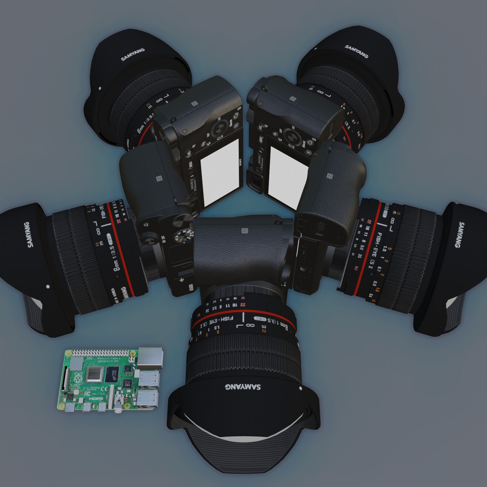
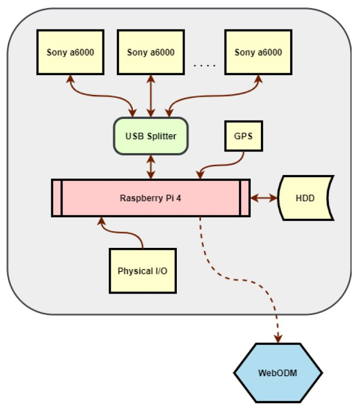
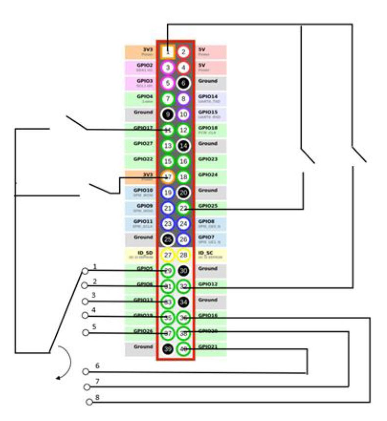

# odm360

## Overview

This repository contains code for the EECS 398 group working on the odm360 project with the Cleveland Metroparks. The idea is to build a 360 camera from individual cameras for the purposes of high quality 3D reconstructions in challenging environments where drones don't work or don't work well.



In our specific use case this is built around Sony α6000 using [gphoto2](http://gphoto.org/), but this could be extended to include other cameras, especially other cameras supported by gphoto2 or [that fancy new Raspberry Pi camera](https://www.raspberrypi.org/products/raspberry-pi-high-quality-camera/).



For this implementation, we are using 5 Sony α6000's using a manual Rokinon 2.8/10mm lens. One additional camera could be integrated pointed straight up in cases where the skyward data was beneficial, e.g. urban canyons or heavily forested areas.

Control is via physical buttons and switches to maximize the use of muscle memory and simplify maintenance.



From the 360 data, we can get detailed 3D reconstructions in OpenDroneMap:


See also: https://www.opendronemap.org/2020/05/360-cameras/

## Requirements

This project is built around raspbian, but can likely be deployed on almost any linux flavor.

If you wish to test and develop code, we recommend establishing a Miniconda environment.
When deploying on a raspberry pi, you can skip this part.
```
conda env create -f environment.yml
```
Before installation, make sure you have the gphoto2 library installed with
```
sudo apt install libgphoto2-dev
```
If you are working on a isolated conda environment, then first activate it.
```
conda activate odm360
```
Then install odm360 as developer with
```
pip3 install -e .
```
